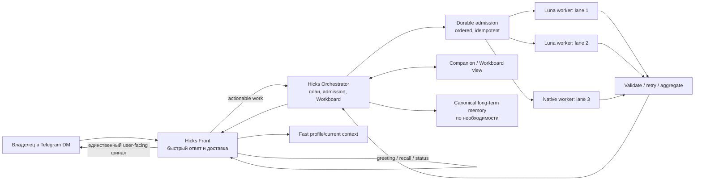

# Hicks: целевая архитектура Front и Orchestrator

Этот документ фиксирует контракт для Hicks как личного цифрового ассистента владельца и одновременно отделяет доказанное текущее состояние от планируемого поведения. Он предназначен для реализации, проверки и отката; это не обещание, что одна только формулировка промпта создаёт отсутствующие runtime-возможности.

Хронология расследования и текущие live-доказательства находятся в [WORKLOG.md](WORKLOG.md). Этот план задаёт устойчивую целевую модель и критерии приёмки.

## Статус и границы

**Текущий факт.** В live-конфигурации `main` использует workspace `/home/clawd/.openclaw/obsidian-operating-base`, модель `openai/gpt-5.6-luna`, `sessions_spawn`, `node_exec` и Workboard. Ранее изменялся `/home/clawd/.openclaw/workspace`; это не workspace `main` и не является источником загруженного prompt-контекста. Свежий `openclaw agent --json` подтвердил загрузку `AGENTS.md` и `SOUL.md` из `obsidian-operating-base` без усечения. Доказанный fixture создал и перечитал файл на Windows node; Linux-path fixture выявил, что текущий `node_exec` направлен на Windows, а не в WSL.

**Цель.** Telegram Front остаётся быстрой пользовательской точкой входа, Orchestrator владеет разложением и Workboard, а независимые нативные OpenClaw workers (предпочтительно Luna, если он реально доступен) выполняют отдельные задачи параллельно. Владелец считает всю выделенную Windows-машину внутренней sandbox boundary: native Windows доступ за пределами WSL входит в разрешённую рабочую поверхность. Front единолично отправляет владельцу подтверждение, статус и финальный результат. Worker не пишет владельцу напрямую.

**Источник истины.** Версионируемая политика prompt находится в `src/agents/system-prompt.ts` (`buildOwnerExecutionPolicySection`) и покрыта `src/agents/system-prompt.test.ts`; live-персона и standing orders находятся в существующем customization asset `/home/clawd/.openclaw/obsidian-operating-base/{AGENTS.md,SOUL.md}`. Применение source-кода к live dist выполняется владельцем deployment-пути OpenClaw. Изменение prompt не подменяет конфигурацию инструментов, права, маршрутизацию или lifecycle Gateway.

## Целевая схема

## Execution planes и каноническая маршрутизация

Внутренняя Windows-машина является одной доверенной рабочей boundary, но её execution planes различаются по владельцу и доказательству результата:

| Plane                              | Владелец и назначение                                                                                  | Канонический путь                                                                                                                | Запрещённая подмена                                                                                                      |
| ---------------------------------- | ------------------------------------------------------------------------------------------------------ | -------------------------------------------------------------------------------------------------------------------------------- | ------------------------------------------------------------------------------------------------------------------------ |
| **WSL Linux**                      | Linux CLI, OpenClaw Gateway, Linux services, repo/build/test и Linux filesystem                        | Gateway/OpenClaw structured call с явным WSL target; затем `wsl.exe -d Ubuntu-24.04 -- ...` только в owner-approved host adapter | Не считать Windows node или SSH в Windows эквивалентом WSL-local state                                                   |
| **Privileged native Windows Node** | PowerShell, Windows services, registry, native files, installers, Windows networking and system repair | Persistent paired native node через канонический Gateway `node_exec`/typed node command с выбранным Windows target               | Не делать ad hoc WSL→Windows SSH, не требовать interactive login для системной задачи                                    |
| **User-session browser Node**      | Authenticated browser/UI, profile-bound cookies, desktop-visible actions и screenshots                 | Persistent user-session browser node через Gateway browser API; перед мутацией fresh `status`, `tabs`, snapshot                  | Не использовать privileged/system node для user-session UI и не считать browser process alive доказательством результата |

Orchestrator выбирает plane по типу операции и явно фиксирует `executionPlane`, target node, owner, generation и evidence boundary в lane admission. Если нужный plane отсутствует, Front не выдаёт владельцу команду для ручного обхода: Orchestrator автоматически пытается provision/reconnect штатный node или сообщает конкретный blocker. Владелец не должен интерактивно входить в Windows для обычной system task.

Native Windows Node и browser node должны стартовать автоматически, поддерживать watchdog/reconnect и возвращать authoritative capability/health generation. WSL restart, Gateway restart, node kill, network interruption и Windows reboot являются штатными lifecycle events: после восстановления Orchestrator revalidates placement и claims, fenced stale workers не продолжаются через старую копию authority.

### Роли и запреты

| Роль                     | Всегда делает                                                                                                                                                                                                                         | Не делает                                                                                                                                                    |
| ------------------------ | ------------------------------------------------------------------------------------------------------------------------------------------------------------------------------------------------------------------------------------- | ------------------------------------------------------------------------------------------------------------------------------------------------------------ |
| **Telegram Front**       | Быстро подтверждает получение существенной задачи; отвечает на приветствие и простой recall локально; переводит `status/steer/cancel` в состояние текущего orchestration run; отправляет владельцу только проверенные статусы и финал | Не выполняет долгий turn; не создаёт worker для «привет» или «как дела?»; не обещает успех по факту очереди; не передаёт владельцу необработанный worker-чат |
| **Hicks Orchestrator**   | Владеет intent, dependency graph, durable admission, Workboard, worker placement, retry policy, aggregation и acceptance evidence                                                                                                     | Не скрывает failure; не сериализует независимые lanes из-за общей очереди; не передаёт worker право общаться с владельцем                                    |
| **Native worker / Luna** | Выполняет ровно назначенную bounded lane, пишет доказательства и terminal outcome в orchestrator channel/state                                                                                                                        | Не меняет план самовольно; не отправляет Telegram DM; не использует plaintext secret, если передан reference; не объявляет общий результат успешным          |
| **Companion**            | Показывает owner-approved progress и evidence из Workboard                                                                                                                                                                            | Не становится вторым orchestrator и не создаёт расходящуюся правду о состоянии                                                                               |

## Маршрутизация intent Front

1. **Casual/local.** Greeting, small talk и простой вопрос о заранее загруженном факте отвечаются Front без worker и без широкого memory search.
2. **Control.** `status`, `steer`, `cancel`, «продолжай» и «останови» разрешаются относительно текущего run/Workboard. Front сразу отвечает текущим состоянием, а мутация состояния идёт через Orchestrator.
3. **Actionable.** Любая работа с изменением файла, системой, браузером, интеграцией, SSH, разработкой или проверкой передаётся Orchestrator.
4. **Mixed.** Front немедленно отвечает социальной частью и одновременно создаёт admission для actionable части.
5. **One task, many lanes.** Один пользовательский work task получает один orchestrator run и столько независимых worker lanes, сколько нужно dependency graph. Новая параллельная lane не должна ждать завершения несвязанной lane.

Front получает быстрые owner facts из bounded preloaded profile/current context. Подробная история запрашивается из canonical long-term memory только по необходимости; записи выполняются в фоне и не блокируют ответ. Явное исправление или forget владельца имеет приоритет над старым фактом.

## Полномочия владельца и секреты

В личном Telegram DM владельца явное поручение является авторизацией для внутренней цифровой работы на всей Windows-машине: локальный admin, native PowerShell, registry, services, install, code/config/system/browser/integration, WSL и обратимые repairs выполняются без рутинного запроса разрешения. Отдельный вопрос допустим только для физического доступа, 2FA/CAPTCHA, действительно необратимого внешнего действия или материального выбора, который нельзя безопасно вывести из контекста.

Ключ или credential, явно переданный владельцем в этом DM, разрешено применить только к названной задаче. Перед использованием нужно:

- не печатать значение в ответ, prompt, лог, commit, Workboard или worker message;
- сохранить его только с restrictive permissions либо использовать штатный secret reference;
- передавать worker reference, а не plaintext, где это возможно;
- не считать ключ скомпрометированным только из-за того, что его передал владелец;
- после операции доказать границу результата и удалить временный материал, если он больше не нужен.

Конфигурационный proxy/VLESS сохраняется. Замена его или другого material state требует rollback copy до изменения и отдельной проверки маршрута после изменения.

## Admission, очередь и параллельное выполнение

Orchestrator сначала создаёт один durable run и его lane records в Workboard, с idempotency key, owner/session binding, dependency edges и acceptance criteria. Этот короткий admission должен быть упорядоченным: либо запись принята целиком, либо владелец получает видимый blocker. Только после commit Orchestrator вызывает native `sessions_spawn` для ready lanes.

После admission ready lanes запускаются параллельно до реального runtime cap (`maxConcurrent`, `maxChildren`, depth и allowlist из live config). Queue хранит порядок событий, дедупликацию и состояние, но не является глобальным mutex. Lane ждёт только declared dependency; завершение другой независимой lane не должно блокировать её. Для каждой lane target plane выбирается до spawn; worker не переключается между WSL, native Windows и browser node по догадке.

Каждая lane сообщает `started`, bounded progress, `succeeded` с evidence или `failed` с typed blocker. Orchestrator валидирует evidence, безопасно повторяет transient failure с новым attempt id, не повторяет irreversible operation без нового owner decision и агрегирует только terminal outcomes. Workers получают parent run identity и authoritative placement; stale/restarted placement fenced и не возобновляется через старый bearer payload.

## Inline flow

Целевой протокол: `Telegram inline_query -> Front typed disposition -> immediate inline answer/ack -> automatic Orchestrator admission for actionable work -> native workers/model -> Front final DM`.

Inline query is classified by the Front owner boundary as `local`, `control`, `actionable`, or `mixed`. Local social/informational replies are returned directly without a model, search, worker, or Workboard admission. Actionable requests receive an immediate useful acknowledgement and are admitted automatically with one idempotency key; mixed requests return their social part immediately while the action is admitted in the background. Reply/message context is carried into the canonical admission when the channel provides it. There is no model-visible Execute button or second commit click; accepted work delivers its terminal result to the owner DM.

## Lifecycle, restart и exactly-once

- Admission и Workboard являются durable; in-flight worker state восстанавливается по run/lane/attempt, а не по памяти процесса.
- Gateway restart закрывает активные turn claims и повышает lifecycle generation. Старый worker не может продолжить privileged действие; Orchestrator либо безопасно reclaims lane, либо сообщает blocker.
- Повтор Telegram update, retry или reconnect использует idempotency key и не создаёт второй side effect. Correlation id не является разрешением.
- Результат отправки владельцу хранит delivery receipt. Повторная отправка разрешена только для того же canonical payload и owner/source binding.
- Изменение prompt, tool surface, plugin manifest или model catalog применяется после штатного reload/restart и фиксируется generation id. Нельзя заявлять, что новая политика жива, пока fresh session не показывает её source/hash.

### Recovery contract

Recovery является частью acceptance, а не ручной эксплуатационной надеждой:

1. Убить native Windows Node: watchdog поднимает его, Gateway получает новую capability generation, новая reversible lane выполняется через native node, stale claim отклоняется.
2. Перезапустить WSL: Gateway/OpenClaw возвращается, queued admission не дублируется, Linux fixture и Workboard read/write проходят после reconnect.
3. Перезапустить Gateway: Front остаётся или восстанавливает delivery, Workboard восстанавливает run/lane state, старые workers fenced, повторная доставка idempotent.
4. Оборвать сеть: Front фиксирует transport blocker, не объявляет успех; после восстановления reconnect и measured retry продолжают только безопасную lane.
5. Перезагрузить Windows: auto-start поднимает Gateway, privileged native node и browser node; после fresh pairing/status каждая plane проходит отдельный nonsecret fixture.

Каждый recovery test должен содержать событие отказа, время обнаружения, generation до/после, отсутствие duplicate side effect, native execution evidence и browser evidence там, где plane заявлена.

## Изоляция отказов

| Отказ                        | Поведение                                                                                                                |
| ---------------------------- | ------------------------------------------------------------------------------------------------------------------------ |
| Одна worker lane упала       | Остальные независимые lanes продолжают; Orchestrator делает bounded retry или помечает одну lane blocker                 |
| Model/provider timeout       | Lane terminal failure с timing/evidence; не блокирует Front и не делает fake success                                     |
| Workboard/SQLite недоступен  | Новая работа не принимает side effect без durable admission; Front сообщает blocker                                      |
| Telegram delivery недоступна | Результат остаётся durable, delivery retry идёт отдельно; acceptance не смешивается с model/process health               |
| Windows node недоступен      | Только затронутые Windows lanes блокируются; WSL/local lanes продолжают, если их boundary доступна                       |
| Proxy/VLESS сломан           | Не обходить proxy; сохранить rollback и показать измеренный transport blocker                                            |
| Worker просит secret         | Front не форвардит plaintext; Orchestrator выдаёт scoped reference или поднимает единственный irreducible owner question |

## Наблюдаемость и SLO

Целевые значения ниже являются **планом**, пока не подтверждены live измерениями:

- Front acknowledgement для принятой существенной задачи: p95 ≤ 2 s;
- status/cancel/steer: видимый ответ ≤ 2 s после чтения authoritative state;
- admission commit: p95 ≤ 5 s, с idempotency receipt;
- запуск ready workers: p95 ≤ 5 s после commit, ограничен runtime cap;
- каждая lane имеет `run_id`, `lane_id`, `attempt_id`, `parent_execution_id`, model/provider, start/end, duration, terminal state и evidence refs;
- метрики разделяют Telegram ingress/delivery, Front, admission, worker, model, tool, proxy/VLESS и Companion, чтобы listener/process health не выдавался за пользовательский успех;
- Companion показывает board state, dependency blockers, last evidence, retry count и generation, но не secret values.

Минимальная acceptance evidence для любого поручения: пользовательский ingress/ack, authoritative admission, worker terminal outcome, реальная внешняя граница (файл/сервис/SSH/browser/Telegram), и финальная доставка владельцу. Если одна часть отсутствует, состояние остаётся `UNKNOWN`.

## План миграции

### Политика обязательного proxy/VLESS

Для Hicks процесс с активным managed proxy обязан использовать этот маршрут для Telegram Bot API и внешних model/Codex запросов. Telegram runtime получает эту policy из существующего `proxy.enabled` контура и передаёт её во Front, polling, webhook, startup probe, target lookup и client cache; при отсутствии маршрута, ошибке инициализации proxy dispatcher, `NO_PROXY` обходе, непрозрачном fetch override или caller dispatcher запрос завершается bounded видимой ошибкой. Generic OpenClaw transport без `requireProxy` сохраняет свой существующий direct/env fallback для совместимых non-Hicks конфигураций.

Codex app-server children наследуют process proxy environment и `OPENCLAW_PROXY_ACTIVE`; spawn helper отказывает до запуска при активном managed proxy без унаследованного proxy route. Model transport Front/Orchestrator/workers также отказывает до guarded fetch, если active marker остался без применимого env route. Восстановление выполняется повторным созданием транспорта после восстановления proxy lifecycle; direct fallback не разрешён. Эта policy не добавляет отдельной config или SQLite surface.

### Фаза 0 — зафиксировать базу

- Источник и live mapping: `src/agents/system-prompt.ts`, `src/agents/system-prompt.test.ts`, live `obsidian-operating-base/{AGENTS.md,SOUL.md}`, runtime `openclaw.json`.
- Снять backup prompt/config/dist и записать hash/generation в `WORKLOG.md`.
- Не трогать старый `/home/clawd/.openclaw/workspace` до отдельного решения о его назначении.

### Фаза 1 — prompt и Front contract

- Оставить owner policy в `buildOwnerExecutionPolicySection`; держать её bounded и пропускать в full main/front prompt.
- В workspace policy закрепить Front/Orchestrator/worker boundary, casual-local, mixed-intent и fast-memory правила.
- В `extensions/telegram/src/bot-handlers.inline.ts` сохранять bounded personal inline answers and automatic typed Front routing; acceptance требует свежие Telegram события, а не только dist proof.

### Фаза 2 — durable orchestrator

- Использовать `extensions/workboard/src/{dispatcher.ts,tools-orchestration.ts,store.ts,lifecycle-sync.ts}` как owner boundary Workboard; не добавлять параллельный JSON/sidecar state.
- Использовать `src/agents/tools/sessions-spawn-tool.ts`, `src/agents/subagents/spawn/*` и `src/gateway/agent-runtime-session-spawn-context.ts` для native placement, identity и fencing.
- Разделить ordered admission от parallel ready-lane dispatch; добавить тесты на две независимые lanes, dependency wait, restart reclaim, duplicate update и worker-no-user-delivery.

### Фаза 3 — память и Companion

- Fast profile/current context должен быть bounded и preloaded в Front path; подробный recall остаётся в `extensions/memory-core/src/memory/*` и `src/gateway/server-methods/memory-search.ts`.
- Background writes идут через канонический memory writer; owner correction/forget supersedes stale entries.
- Companion читает authoritative Workboard projections и evidence, а не session transcript scraping.

### Фаза 4 — live rollout

- Собрать exact-head dist, атомарно развернуть через существующий deployment owner, restart только нужного Gateway и записать backup/generation.
- Deployment owner обязан переносить полный install bundle, а не только `dist`: package metadata (`package.json`/plugin manifest), `node_modules` и matching optional platform artifact `@openai/codex-<platform>-<arch>` должны входить в staged payload либо быть явно сохранены в том же owner path. Если зависимости остаются с предыдущей установки, owner сначала валидирует их exact version, native artifact и executable resolution; молчаливый dist-only cutover запрещён.
- До замены live tree owner запускает `openclaw doctor --lint --only codex/managed-app-server --json` и проверяет, что resolved managed executable существует, запускается с `--version` и соответствует pinned version. После restart readiness требует один bounded nonsecret `openclaw agent --agent main --json` smoke через owning Gateway (или `--local` только в изолированном state directory) с ожидаемым ответом; listener/process health без этого не является `ready`.
- Backup/rollback должен охватывать весь runtime bundle (`dist`, package metadata и managed dependency tree), а не только `dist`. При failed preflight cutover не выполняется; при failed post-restart smoke owner возвращает предыдущий полный bundle и повторяет тот же preflight до объявления recovery.
- Checked-in canonical owner: `scripts/hicks-deploy-runtime.mjs`, delegated by the existing `scripts/update-gateway.sh` when `OPENCLAW_UPDATE_INSTALL_ROOT` is set. Он stages the existing full install tree, overlays source `dist`/`openclaw.mjs`/`package.json` and the matching `@openai/codex` plus current-platform optional package, writes a bundle manifest, runs the Codex package contract and doctor JSON gate, then performs stop → same-filesystem rename cutover → start → bounded agent smoke. A failed start/smoke moves the failed tree aside, restores the complete prior tree, and starts the Gateway again; config/state and proxy/VLESS environment remain outside the install root. `--dry-run` exercises staging and all preflight gates without cutover. The fixture contract is `test/scripts/hicks-deploy-runtime.test.ts`.
- Запустить nonsecret fixture на каждом фактическом execution boundary: WSL, Windows node, browser и SSH test host. Не считать prompt-only unit test live proof.
- Проверить execution-plane routing через structured Gateway calls: WSL Linux, privileged native Windows Node и user-session browser Node. Ad hoc WSL→Windows SSH не является acceptance path; SSH остаётся отдельной внешней boundary для специально названной задачи.
- Прогнать recovery contract для node kill, WSL restart, Gateway restart, network interruption и Windows reboot с автоматическим reconnect/watchdog.
- Провести Telegram DM, Telegram inline/chosen/edit, Companion, Windows, browser и SSH acceptance matrix. До этого не заявлять end-to-end success.

## Матрица приёмки

| Boundary                | Проверка                                                                                                                             | Текущее состояние                                                                                                                              | Done требует                                                                                                                    |
| ----------------------- | ------------------------------------------------------------------------------------------------------------------------------------ | ---------------------------------------------------------------------------------------------------------------------------------------------- | ------------------------------------------------------------------------------------------------------------------------------- |
| Prompt assembly         | Fresh `openclaw agent --json` показывает workspace, injected files, hash и role clauses                                              | **PASS для workspace asset**; source hardcoded policy ждёт deployment                                                                          | Hash/source mapping после restart/update и regression test                                                                      |
| Self-execution          | Nonsecret fixture создаёт/читает marker, удаляет его                                                                                 | **PASS на Windows node**; Linux WSL path **BLOCKED/известный runtime факт**                                                                    | Каждая заявленная execution boundary отдельно доказана                                                                          |
| Execution-plane routing | Structured call выбирает WSL, native Windows или browser node по типу операции                                                       | **PARTIAL**: Windows `node_exec` доказан; WSL/browser routing не приняты                                                                       | Fresh WSL fixture, privileged native Windows fixture и user-session browser snapshot/action                                     |
| Telegram DM Front       | Owner message получает ack/status/final из Front                                                                                     | **UNKNOWN** после этой policy-only проверки                                                                                                    | Свежие Telegram-visible сообщения с timestamps и run ids                                                                        |
| Native orchestration    | Одно поручение создаёт несколько независимых Luna/native workers                                                                     | **UNKNOWN**; prompt описывает контракт, runtime proof не сделан                                                                                | WorkBoard + `sessions_spawn` traces показывают parallel lanes и aggregation                                                     |
| Queue                   | Независимые lanes не ждут одна другую                                                                                                | **UNKNOWN**                                                                                                                                    | Concurrency fixture и live trace                                                                                                |
| Companion               | Board показывает owner-visible authoritative progress/evidence                                                                       | **UNKNOWN**                                                                                                                                    | Fresh Companion read-only snapshot и matching Workboard rows                                                                    |
| Inline                  | typed disposition → immediate answer/ack → automatic admission → worker → final DM                                                   | Source routing and no-button regressions **PASS**; live inline/admission/final DM **UNKNOWN**                                                  | Свежие Telegram events на всей цепочке                                                                                          |
| Windows                 | Native node выполняет PowerShell/service/registry/files/install без interactive login                                                | **PARTIAL**: fixture PASS                                                                                                                      | Reversible native operation через structured Gateway call с before/after evidence                                               |
| Browser                 | Persistent user-session browser node: fresh status/tabs/snapshot, action и user-visible result                                       | **UNKNOWN**                                                                                                                                    | Fresh browser node status + action/result evidence                                                                              |
| Recovery                | Node kill, WSL/Gateway restart, network interruption и Windows reboot автоматически восстанавливают нужные planes                    | **UNKNOWN**                                                                                                                                    | Recovery contract с generation, reconnect, no-duplicate и native/browser proof                                                  |
| SSH/AP                  | Owner-supplied key used only for named reversible task, route preserved, AP result measured                                          | **UNKNOWN**; key не печатался и не использовался этим policy fixture                                                                           | Fresh SSH auth, exact AP action, before/after reachability and rollback evidence                                                |
| Secrets                 | Plaintext absent from chat/logs/prompts/worker messages                                                                              | **PASS для policy fixture**; no secret written                                                                                                 | Secret-reference audit on a redacted test credential                                                                            |
| Restart                 | New generation reloads prompt, board recovers, stale workers fenced                                                                  | **UNKNOWN**                                                                                                                                    | Restart/recovery run with generation and no duplicate side effect                                                               |
| Deploy bundle           | Full install preserves package metadata, managed `node_modules/@openai/codex*`, exact executable resolution, rollback and smoke turn | **PASS for checked-in dry-run/fixture transaction**; live install remains on the manually repaired bundle until the next authorized deployment | Run the owner against Hicks after the Runtime Luna slice, retain its backup path, and capture doctor + post-restart agent smoke |

### Definition of done

Работа считается завершённой только когда все строки матрицы имеют свежую evidence, все ранее `UNKNOWN` переведены в `PASS` или конкретный reproducible `BLOCKED` с owner-visible next step, а обязательная release acceptance не оставляет `UNKNOWN`. Для user-facing completion это означает: Telegram ingress, Front response, durable admission, actual execution boundary, validated terminal evidence и финальная Telegram delivery подтверждены одной коррелированной цепочкой.

## Откат

1. Остановить новые admissions через Orchestrator, дождаться или отменить только безопасные lanes.
2. Зафиксировать Workboard snapshot и generation; не удалять evidence.
3. Вернуть предыдущий dist/config атомарно из deployment backup и перезапустить только соответствующий Gateway.
4. Вернуть live `AGENTS.md` и `SOUL.md` из backup `/home/clawd/.openclaw/backups/hicks-policy-20260906-2245/` при откате policy asset.
5. Проверить fresh prompt hash, Telegram delivery, proxy/VLESS route и отсутствие duplicate side effects.
6. Записать результат и оставшиеся `UNKNOWN` в [WORKLOG.md](WORKLOG.md); не называть rollback восстановлением пользовательского сервиса без boundary evidence.

## Известные текущие проблемы

- Prompt policy не создаёт runtime routing: фактический worker fan-out, Workboard ownership и Front-only delivery ещё требуют live acceptance.

- Source owner now provides typed Front admission through `extensions/workboard/src/front-admission.ts` and core `subagent.spawnVisible`. It uses native visible-spawn requester completion tracking, Workboard as durable projection, exact post-await Front-session revalidation, and a Telegram plugin-owner/owner-authorized fence on the inline gateway bridge. This is source/test evidence only; live Telegram final delivery, three-worker depth-2 trace and restart replay remain unaccepted.

### Memory lane audit — 2026-09-07

Текущий код имеет только подготовку memory prompt и repository-scoped bootstrap; отдельного user-message-aware локального Front memory router нет. `prepareProjectMemoryBootstrap()` использует canonical memory manager и поэтому не является быстрым профилем. Live `USER.md` уже попадает в bootstrap контекст и содержит owner facts; отдельный canonical current-task summary не найден. Read-only probes через Gateway дали 8.053s и 7.126s для name/timezone, поэтому заявленные ~30s не воспроизведены и не могут быть приписаны memory без фазовых таймингов.

Следующий source-owned шаг должен начинаться с существующего Front admission seam: классификация simple owner recall до model/worker, bounded deterministic snapshot из уже загруженных canonical context files, затем обычный `memory_search` только для подробного recall. Не добавлять SQLite/JSON store или дублирующий profile файл. Acceptance: cold/warm name/age/preference, correction+restart, long-term recall, zero worker/search calls for simple recall, hard prompt cap and deterministic ordering; unknown until a real Front path exists and is measured.

Inline routing boundary: Telegram supplies an authorized private inline query to the generic channel runtime; Workboard owns typed Front classification and canonical admission. The inline article contains the immediate local answer or action acknowledgement and no callback button. Runtime tests cover zero admission for local input, automatic actionable/mixed routing, bounded answer time, and exactly-once correlation; live inline events and final owner DM remain UNKNOWN.

- Текущий `node_exec` направляет Linux-path fixture на Windows node; WSL-local, native privileged и user-session browser execution-plane routing ещё не приняты как отдельные structured boundaries.
- Auto-start/watchdog/reconnect и recovery после node kill, WSL/Gateway restart, network interruption и Windows reboot ещё не прошли acceptance.
- Telegram inline behavior changed from placeholder/confirmation to automatic typed routing; no fresh live inline query or final owner DM has been sent in this source-only slice.
- Windows SSH/AP поручение остаётся `UNKNOWN`; предоставленный ключ не выводился и не объявлялся скомпрометированным, но точный AP before/after результат не зафиксирован.
- Никакая строка выше не означает, что browser, Companion или Telegram end-to-end уже приняты.
- Ранее dist-only deployment заменил live `dist` без полного managed dependency bundle; первый нормальный DM выявил отсутствующий Linux Codex artifact. Пакеты были восстановлены из существующего owner-managed project path. Checked-in owner и fixture rollback теперь закрывают этот класс дрейфа; live migration на него ждёт следующего авторизованного rollout после safe Runtime Luna slice.

## Versioned customization mapping

The concise owner policy is versioned at `customization/hicks/OWNER_POLICY.md`; the canonical internal tool profile is `customization/hicks/HICKS_ORCHESTRATOR_TOOL_POLICY.json`. The runtime policy is emitted by `src/agents/system-prompt.ts` and covered by `src/agents/system-prompt.test.ts`; the live loaded standing orders are `/home/clawd/.openclaw/obsidian-operating-base/{AGENTS.md,SOUL.md}`. The checked-in deployment owner stages these assets plus the full plan and worklog under the configured workspace's `hicks-reference/` directory with a checksum manifest and rollback copy. The orchestrator profile must be applied from the versioned JSON after deployment: `profile: full` supplies native machine/session tools and `alsoAllow` explicitly discovers optional Workboard tools. A live update must apply that bundle and then run fresh main-agent and internal-orchestrator prompt assembly checks. The older `/home/clawd/.openclaw/workspace` files are not the main-agent source and must not be used to assess drift.

## 2026-09-07 Front/inline acceptance thresholds and authority evidence

The inline path has one bounded phase. Query-time authorization is bounded to 900ms and returns one personal answer produced by the Front disposition route. Local turns stop there; actionable and mixed turns enter the durable Front admission owner automatically under a correlation id. Workboard accepts only the in-process Telegram plugin owner context and never trusts a caller boolean as owner proof.

The project acceptance thresholds are explicit targets, not Telegram API guarantees: inline-answer p95 <=2s, internal answer envelope <=10s, and any first-answer path at or above 13s is FAIL. The source uses a 9s inline-only answer envelope to leave margin under the 10s target; this does not alter the global Telegram transport timeout. Live validation must measure 2s/9s/10s/13s boundaries with real Telegram timestamps and distinguish `BOT_RESPONSE_TIMEOUT` transport evidence from automatic Front admission and final DM delivery.

The answer envelope uses the already injected Telegram Bot API context, including the configured proxy/VLESS transport; it adds no direct client, bypass, fallback, or retry path. Native child admission inherits the existing runtime/config proxy boundary. Source/test evidence for this slice: native child rollback is exercised after both parent-session revalidation and launch-acceptance failure; account-separated and multi-owner inline commits, wildcard DM versus owner authority, revocation, forged gateway context, and hanging commit/answer transport are covered. Core and extension type checks, targeted lint/format, and the unchanged 4,355 public plugin-SDK export budget are required before any live rollout. Live Telegram final-DM, depth-0→1→2, restart/replay and Companion evidence remain pending.

Final transport/callback review evidence: the existing proxied Bot API fetch now applies a method-specific 9,000 ms transport abort for `answerinlinequery`, before any configured timeout can extend it; the inline handler keeps its bounded answer envelope for user-visible timing evidence. Callback data is capped at Telegram's 64-byte UTF-8 limit, with oversized or multibyte correlations represented by a deterministic SHA-256 digest and resolved through the same pending key. The combined acceptance set was repeated without the earlier front-admission CAS nondeterminism: the 6-file extension set passed 3/3, the runtime pair passed 3/3, and the 9-file aggregate passed 3/3 (agents 133, plugins 28, Telegram 51, Workboard 16). This is source/test evidence only; live Telegram timing, final-DM delivery and proxy route proof remain pending.

Proxy owner review (2026-09-07): upstream Codex reads inherited HTTP proxy variables only with `features.respect_system_proxy=true`; managed OpenClaw app-server launch now enforces that option when `OPENCLAW_PROXY_ACTIVE=1` (`extensions/codex/src/app-server/transport-stdio.ts`). The source gate rejects a marker with only `OPENCLAW_PROXY_URL`, since upstream Codex does not consume that variable as a route. Current live Gateway has the canonical proxy variables but lacks the active marker, so service-owner marker installation and an actual managed-child route probe remain required before proxy acceptance.

Live proxy owner follow-up (2026-09-07): the owned systemd Gateway drop-in was backed up and updated with `OPENCLAW_PROXY_ACTIVE=1` beside the canonical HTTP proxy variables, then reloaded and restarted. MainPID 233870 returned active/running with readiness and status-only Telegram/OpenAI proxy probes passing (HTTP 200 / HTTP 401). A bounded managed-child smoke observed child PID 234342 inheriting the marker and all three standard proxy variables; the exact smoke model response succeeded and the process exited cleanly. This is proxy-chain acceptance evidence for the Gateway and one child, not the full long-soak/Telegram-visible product gate.
